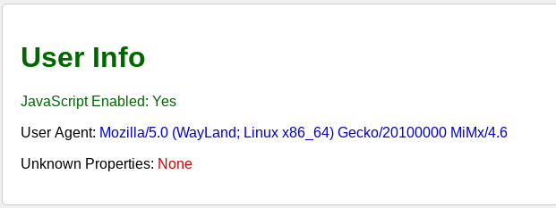

# puzzle tools GitHub Pages
## userinfo

A tool to help security pentesters identify "User Info" in unknown browsers. 
The tools detect unknown properties in the browser context (for example, a Java bridge or a React DevTools extension)
and show it nicely. And since those browsers don't always have an address bar, I've added a "redirect" button

for educational purposes only.
to use it go to [/info](https://puzzle-tools.github.io/info).